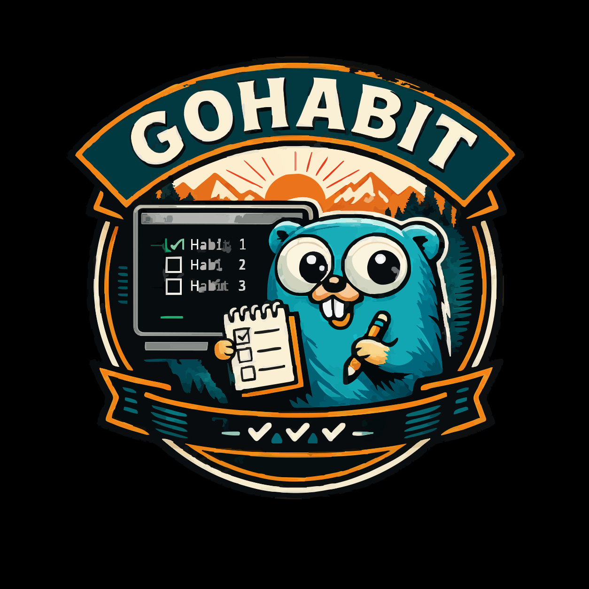
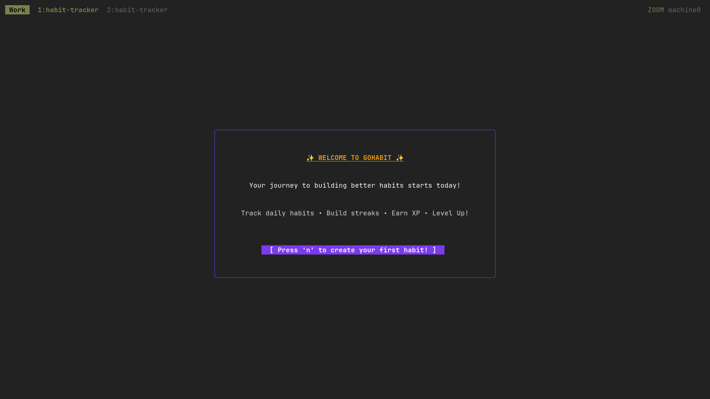
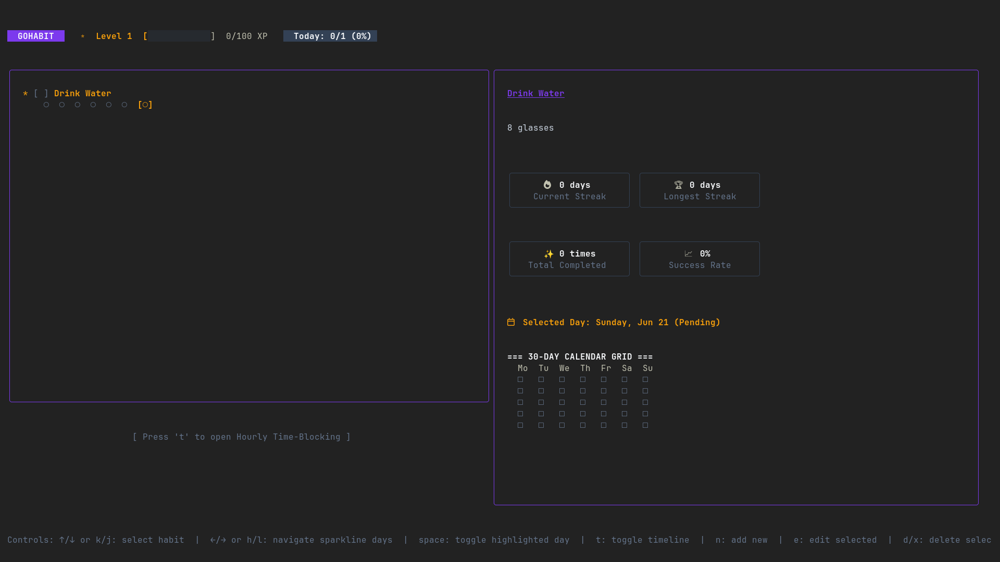
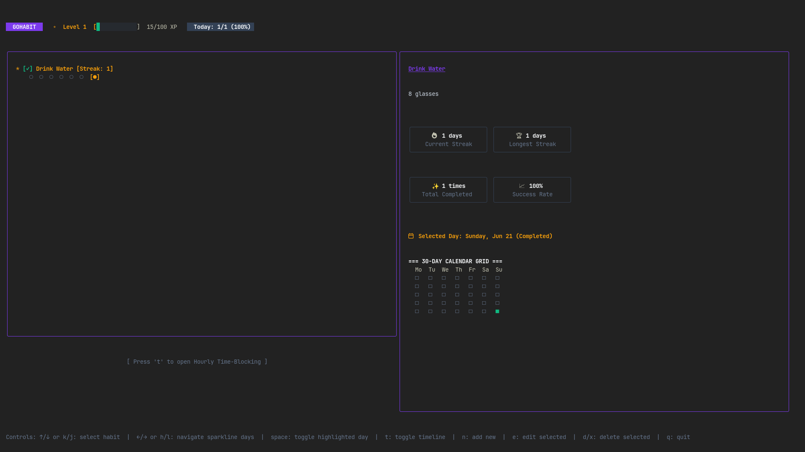

<div align="left">
  
</div>

# Gohabit
[](https://golang.org/dl/)
[](LICENSE)
[](https://github.com/ucmz851/gohabit)

[](https://github.com/ucmz851/gohabit/releases)
[](https://github.com/ucmz851/gohabit/releases)
[](https://github.com/ucmz851/gohabit/stargazers)

A beautiful, sleek, and gamified Terminal User Interface (TUI) for tracking daily habits, built with **Go**, **Bubble Tea**, and **Lipgloss**.

---

## Table of Contents

- [Overview](#overview)
- [Features](#features)
- [Who is this Project for?](#who-is-this-project-for)
- [Prerequisites](#prerequisites)
- [Installation](#installation)
  - [Quick Install](#quick-install-recommended)
  - [Native Go install](#native-go-install)
  - [Makefile installation](#makefile-installation)
- [Usage](#usage)
  - [Keyboard Shortcuts](#keyboard-shortcuts)
- [Configuration](#configuration)
  - [Configuration Options](#configuration-options)
- [License](#license)
- [Contributing](#contributing)

---

## Overview

Gohabit is an interactive CLI habit tracker designed to help you build consistency. It parses and monitors your local git repositories to auto-complete programming habits and gamifies your daily routines with levels and XP.

**Screenshots**

<p align="left">
  
  <br><em>welcome screen (clean slate first use)</em>
  <br><br>
  
  <br><em>main dashboard showing levels, habit progress, stats grid, and calendar heatmap</em>
  <br><br>
  
  <br><em>hourly time-blocking timeline</em>
</p>

---

## Features

- **🎮 Gamified Progression**: Earn XP (+10 XP per completion, +5 XP per active streak day), level up, and celebrate milestones with system notifications and in-app celebratory headers.
- **🎨 Premium Modern Styling**: Styled with a dark palette (Indigo headers, Gold streaks, Emerald checks) and clean rounded border panels.
- **📅 GitHub-style Calendar Grid**: Monthly contribution heatmaps (`■`, `□`, `·`) to track historical completions at a glance.
- **⏰ Collapsible Hourly Time-Blocking**: Plan out your day in hour slots. The timeline collapses out of sight when not active.
- **🐚 Git repo integration**: Link programming habits to local git repos. The background worker auto-detects commits since midnight and completes the habit.
- **💾 WAL SQLite Backend**: Robust SQLite database integration using WAL (Write-Ahead Logging) and busy timeouts to prevent concurrency locks.
- **📱 Responsive Layout**: Automatically scales and stacks panels vertically on thin windows (width < 96).

---

## Who is this Project for?
- Developers and terminal lovers who want to keep track of their habits inside their workflow.
- Programmers looking for a CLI tool that automatically monitors local git repository activities to track coding habits.
- Anyone looking to gamify their daily routines with a level-based reward TUI client.

---

## Prerequisites

- **Go 1.26+** (only required if compiling from source)
- **Git** (only required if using the Git repository commit tracking feature)

---

## Installation

### Quick Install (Recommended)
Downloads the latest pre-compiled binary matching your OS/architecture or builds from source:
```bash
curl -sSfL https://raw.githubusercontent.com/ucmz851/gohabit/main/get-gohabit.sh | sh
```

### Native Go install
If you have Go installed on your path:
```bash
go install github.com/ucmz851/gohabit@latest
```

### Makefile installation
Build from source and copy the binary to `~/.local/bin` automatically:
```bash
git clone https://github.com/ucmz851/gohabit.git
cd gohabit
make install
```

---

## Usage

Start the interactive dashboard:
```bash
gohabit
```

Gohabit also supports quick CLI inputs to list, check, or add habits directly:
```bash
gohabit list
gohabit check "Drink Water"
gohabit add "Workout" "Go to the gym for 45 minutes"
```

### Keyboard Shortcuts

| Shortcut | Description |
|---|---|
| `↑` / `↓` or `k` / `j` | Select/move between habits |
| `←` / `→` or `h` / `l` | Navigate highlighted day on the 7-day sparkline history |
| `Space` | Toggle completion status for the highlighted day or selected habit |
| `t` | Toggle/open hourly time-blocking timeline |
| `n` | Create a new habit |
| `e` | Edit the selected habit |
| `d` / `x` | Delete the selected habit |
| `q` / `Ctrl+C` | Quit the application |

---

## Configuration

Gohabit generates a default config file at `config.ini` in the working directory on its first run.

```ini
db_path = habits.db
color_header_bg = #7C3AED
color_accent = #F59E0B
color_success = #10B981
week_start = 1
evening_hour = 18
```

### Configuration Options

| Key | Type | Default | Description |
|---|---|---|---|
| `db_path` | string | "habits.db" | Path to SQLite database file. |
| `color_header_bg` | string | "#7C3AED" | Hex color code for the top header background. |
| `color_accent` | string | "#F59E0B" | Hex color code for panel borders and highlights. |
| `color_success` | string | "#10B981" | Hex color code for completed checkboxes/days. |
| `week_start` | int | 1 | Week start day for the calendar (0 = Sunday, 1 = Monday). |
| `evening_hour` | int | 18 | Evening hour to trigger priority habit reminders (0-23). |

---

## Star History

<a href="https://www.star-history.com/#ucmz851/gohabit&Timeline">
 <picture>
   <source media="(prefers-color-scheme: dark)" srcset="https://api.star-history.com/svg?repos=ucmz851/gohabit&type=Timeline&theme=dark" />
   <source media="(prefers-color-scheme: light)" srcset="https://api.star-history.com/svg?repos=ucmz851/gohabit&type=Timeline" />
   
 </picture>
</a>

---

## License

Gohabit is licensed under the [MIT License](LICENSE).

---

## Contributing

PRs and issues are welcome! See the guidelines in the repository.
